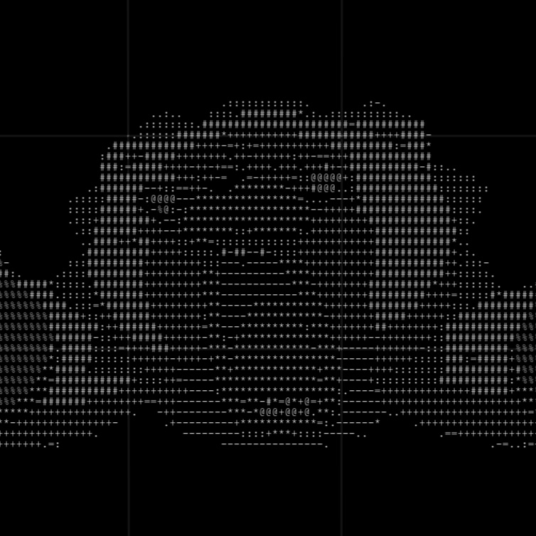

# Things by Om Preetham

A beautiful, interactive 3D space of floating links showcasing my projects and work. Built as a Progressive Web App with modern web technologies.



## Features

- **Interactive 3D Space**: A dynamic grid with perspective transforms and smooth animations
- **Floating Links**: Non-overlapping, randomly positioned links with collision detection
- **Responsive Design**: Optimized for both desktop and mobile devices
- **Theme Support**: Automatic dark/light mode based on system preferences
- **Progressive Web App**: 
  - Offline functionality
  - Installable on devices
  - App-like experience
  - Smooth animations and transitions

## Technology Stack

- Vanilla JavaScript for core functionality
- CSS3 for styling and animations
- Service Workers for PWA features
- CSS Grid and Flexbox for layout
- CSS Variables for theming
- Touch events for mobile interaction

## Project Structure

```
.
├── index.html          # Main HTML file
├── sw.js              # Service Worker for PWA functionality
├── manifest.json      # PWA manifest file
├── logo.jpg           # Logo and favicon
└── vercel.json        # Vercel deployment configuration
```

## Development

1. Clone the repository:
```bash
git clone https://github.com/ompreetham/things-by-om-preetham.git
cd things-by-om-preetham
```

2. Serve the files using any static file server. For example, using Python:
```bash
python -m http.server 3000
```

3. Open `http://localhost:3000` in your browser

## PWA Features

- **Offline Support**: Works without internet connection
- **Installable**: Can be added to home screen
- **Responsive**: Adapts to all screen sizes
- **Fast Loading**: Caches resources for quick access
- **App-like**: Full-screen mode without browser UI

## Deployment

This project is configured for deployment on Vercel:

1. Install Vercel CLI:
```bash
npm i -g vercel
```

2. Deploy to Vercel:
```bash
vercel
```

3. Follow the interactive prompts to complete deployment

## Browser Support

- Chrome (latest)
- Firefox (latest)
- Safari (latest)
- Edge (latest)
- Mobile browsers (iOS Safari, Android Chrome)

## License

[MIT License](LICENSE) - feel free to use this code for your own projects!

## Author

Om Preetham
- Website: [ompreetham.com](https://ompreetham.com)
- GitHub: [@ompreetham](https://github.com/ompreetham)

## Acknowledgments

- Space Grotesk font by Florian Karsten
- Inspired by creative web experiences and interactive designs 